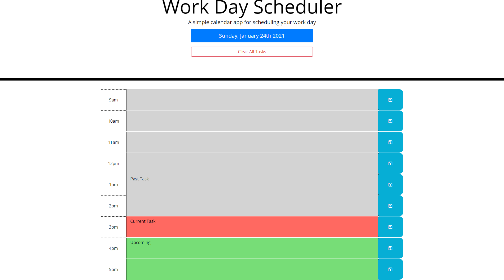

# Day Planner

## Table of Contents
* [Description](#description)
* [The Challenge](#challenge)
* [The Criteria](#criteria)
* [Final Result](#results)
* [Reflection](#reflection)

## Description 
An in-browser day planner using third-party APIs like Bootstrap, JQuery, and Moment.js to save and update a daily task list.

 

## The Challenge 
Create a daily planner to manage time effectively

## The Criteria 
1. When opening the planner, the current day is displayed at the top.
1. Whens scrolling down, the user is presented with time blocks for standard business hours.
1. Each block is color-coded to indicate whether it is in the past, present, or future.
1. You can enter an event and click save to save task to local storage.
1. When page is refreshed, the saved events stay displayed.

## Final Result 
The final generator can be viewed at [https://ianjacksondesign.com/day-planner/](https://ianjacksondesign.com/day-planner/)

## Reflection 
I didn't think I was actually going to finish this one as I got sick over the weekend and could not focus. Besides dealing with whatever bug I had, I also struggled with writing my code despite knowing what I wanted it to do. My biggest struggle was with callback functions and knowing when to pass in parameters. 

In the end I pulled through and was able to complete the assignment with a better understanding of writing functions, selecting objects in the DOM, and dynamically updating a web page.